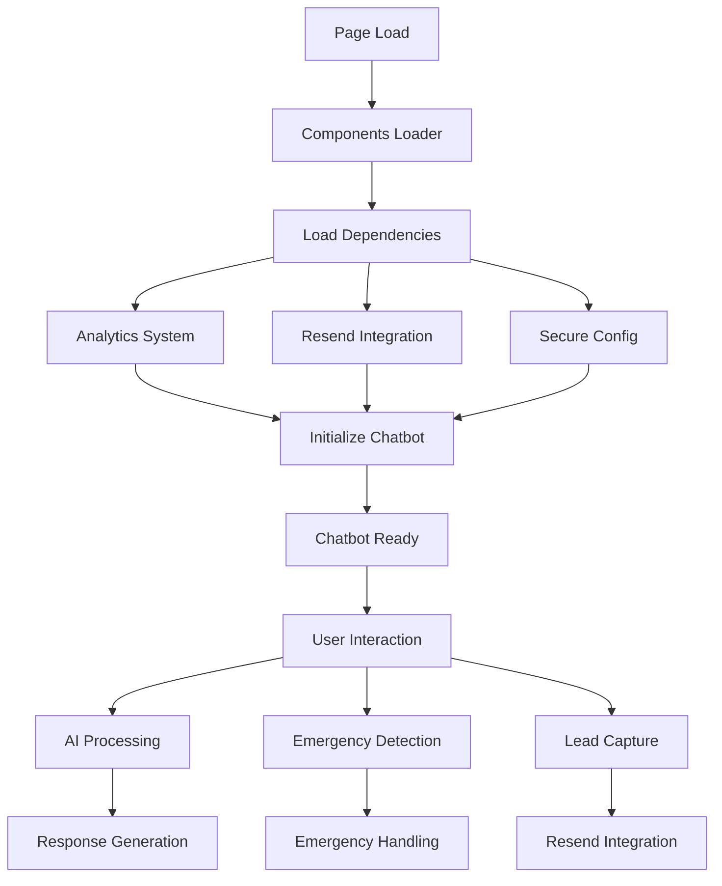

# 🤖 IT-ERA Unified Chatbot System - Documentazione Completa

## 📋 **PANORAMICA SISTEMA**

Il nuovo sistema chatbot unificato di IT-ERA sostituisce e migliora i precedenti `chat-widget-loader.js` e `smart-chatbot.js`, fornendo un'esperienza integrata e ottimizzata per l'assistenza informatica.

### ✅ **CARATTERISTICHE PRINCIPALI**

- **🔗 Integrazione completa** con analytics, Resend, AI e sistemi esistenti
- **🚨 Rilevamento automatico emergenze** con routing intelligente
- **📊 Lead capture automatico** dopo engagement
- **🤖 AI-powered responses** con fallback rule-based
- **📱 Design responsive** ottimizzato per mobile
- **⚡ Performance ottimizzate** con caching e rate limiting
- **🔒 Sicurezza integrata** con sanitizzazione input

---

## 🏗️ **ARCHITETTURA SISTEMA**

### 📁 **File Principali**

```
js/
├── itera-chatbot-system.js     # Sistema chatbot unificato (NUOVO)
├── chatbot-config.js           # Configurazione centralizzata (NUOVO)
├── analytics-system.js         # Sistema analytics esistente
├── resend-integration.js       # Integrazione Resend esistente
├── secure-config.js           # Configurazione sicura esistente
└── components-loader.js        # Caricamento componenti (AGGIORNATO)
```

### 🔄 **Flusso di Integrazione**



---

## 🚀 **INSTALLAZIONE E CONFIGURAZIONE**

### 1. **Integrazione Automatica**

Il chatbot si integra automaticamente con il sistema esistente:

```javascript
// Il chatbot viene caricato automaticamente dal components-loader.js
// Nessuna configurazione aggiuntiva richiesta
```

### 2. **Configurazione Personalizzata**

Modifica `js/chatbot-config.js` per personalizzare:

```javascript
window.ITERAChatbotConfig = {
    // Abilita/disabilita funzionalità
    enabled: true,
    
    // Configurazione UI
    ui: {
        position: 'bottom-right',
        theme: 'it-era-professional',
        autoOpen: false
    },
    
    // Configurazione emergenze
    emergency: {
        enabled: true,
        threshold: 3,
        showBanner: true
    }
};
```

### 3. **Dipendenze Richieste**

Il sistema richiede questi componenti esistenti:
- ✅ `ITERAAnalytics` (analytics-system.js)
- ✅ `ITERAResendIntegration` (resend-integration.js)
- ✅ `ITERASecureConfig` (secure-config.js)
- ⚠️ `ITERAIConfig` (opzionale, per AI responses)

---

## 🔧 **FUNZIONALITÀ DETTAGLIATE**

### 🚨 **Sistema di Rilevamento Emergenze**

**Algoritmo di Rilevamento:**
```javascript
// Punteggio emergenza basato su:
// - Keywords emergenza: +3 punti
// - Indicatori urgenza: +2 punti  
// - Impatto business: +2 punti
// - Scenari specifici: +3 punti

// Soglia emergenza: 3+ punti
```

**Keywords Monitorate:**
- **Emergenze IT**: virus, hacker, server down, backup perso
- **Urgenza**: subito, immediatamente, critico, bloccato
- **Business Impact**: clienti, perdite, fatturato, produzione

**Azioni Automatiche:**
1. 🚨 Mostra banner emergenza
2. 📞 Evidenzia numero 039 888 2041
3. 📧 Invia notifica via Resend
4. 📊 Track evento emergenza

### 📊 **Lead Capture Intelligente**

**Trigger Automatico:**
- Dopo 3+ messaggi di conversazione
- Rilevamento interesse nei servizi
- Richiesta preventivo/informazioni

**Campi Raccolti:**
- Nome completo
- Email
- Telefono
- Conversazione completa

**Integrazione Resend:**
```javascript
// Invio automatico lead via Resend API
const payload = {
    type: 'chatbot_lead',
    full_name: name,
    email: email,
    phone: phone,
    conversation_id: conversationId,
    message_history: messageHistory
};
```

### 🤖 **Sistema AI Integrato**

**Fallback Intelligente:**
1. **Primo tentativo**: AI response (se disponibile)
2. **Secondo tentativo**: Rule-based response
3. **Fallback finale**: Contatti diretti

**Risposte Contestuali:**
- Riconoscimento intent utente
- Risposte specifiche per settore
- Personalizzazione basata su cronologia

### 📱 **Design Responsive**

**Breakpoints:**
- **Desktop**: Widget 380x500px, posizione bottom-right
- **Mobile**: Full-width, altezza 70vh
- **Tablet**: Adattamento automatico

**Animazioni:**
- Pulse effect per attenzione
- Smooth transitions
- Typing indicators
- Emergency shake effects

---

## 📊 **ANALYTICS E MONITORING**

### 🎯 **Eventi Tracciati**

```javascript
// Eventi principali
'chatbot_initialized'     // Inizializzazione sistema
'chatbot_opened'         // Apertura chat
'chatbot_message_sent'   // Messaggio utente
'emergency_detected'     // Emergenza rilevata
'lead_captured'         // Lead acquisito
'chatbot_closed'        // Chiusura chat
```

### 📈 **Metriche Monitorate**

- **Engagement**: Aperture, messaggi, durata sessioni
- **Conversioni**: Lead capture rate, emergency calls
- **Performance**: Response time, error rate
- **User Behavior**: Most common queries, drop-off points

### 🔍 **Dashboard Analytics**

Accesso via `window.ITERAAnalytics.api`:

```javascript
// Ottieni metriche chatbot
const metrics = window.ITERAAnalytics.getMetrics();

// Esporta dati conversazioni
const data = window.ITERAAnalytics.export('json');

// Insights real-time
const insights = window.ITERAAnalytics.getInsights();
```

---

## 🔒 **SICUREZZA E PRIVACY**

### 🛡️ **Misure di Sicurezza**

- **Input Sanitization**: Prevenzione XSS e injection
- **Rate Limiting**: Max 10 richieste/minuto per utente
- **Pattern Detection**: Blocco attività sospette
- **Data Encryption**: Comunicazioni sicure con API

### 🔐 **Gestione API Keys**

```javascript
// API keys gestite tramite ITERASecureConfig
const apiKey = this.secureConfig.getApiKey('openai');

// Nessuna chiave hardcoded nel client
// Fallback sicuro se chiavi non disponibili
```

### 📝 **Privacy Compliance**

- **GDPR Compliant**: Consenso esplicito per data collection
- **Data Retention**: 90 giorni default, configurabile
- **Right to Deletion**: Supporto cancellazione dati
- **Anonymization**: Dati sensibili anonimizzati

---

## 🧪 **TESTING E DEBUGGING**

### 🔍 **Debug Mode**

Abilita debug in `chatbot-config.js`:

```javascript
window.ITERAChatbotConfig.debug = true;
```

**Console Logs:**
- 🤖 Inizializzazione sistema
- 💬 Messaggi e risposte
- 🚨 Rilevamento emergenze
- 📊 Eventi analytics
- ❌ Errori e fallback

### 🧪 **Test Scenarios**

**Test Emergenze:**
```javascript
// Invia messaggio di test
window.ITERAChatbot.sendMessage("Il server è down e ho perso tutti i dati!");
```

**Test Lead Capture:**
```javascript
// Simula conversazione lunga
for(let i = 0; i < 4; i++) {
    window.ITERAChatbot.sendMessage(`Messaggio test ${i}`);
}
```

**Test AI Integration:**
```javascript
// Verifica integrazione AI
console.log('AI Config:', window.ITERAIConfig);
console.log('AI Available:', !!window.ITERAChatbot.aiConfig);
```

---

## 🚀 **DEPLOYMENT E PERFORMANCE**

### 📦 **File Size Optimization**

- **itera-chatbot-system.js**: ~45KB (non minified)
- **chatbot-config.js**: ~8KB
- **CSS Inline**: ~15KB
- **Total Impact**: ~68KB

### ⚡ **Performance Optimizations**

- **Lazy Loading**: Caricamento dopo 1 secondo
- **Response Caching**: Cache 5 minuti per risposte comuni
- **DOM Optimization**: Virtual scrolling per messaggi lunghi
- **Memory Management**: Cleanup automatico sessioni vecchie

### 🌐 **CDN e Caching**

```html
<!-- Preload per performance -->
<link rel="preload" href="/js/itera-chatbot-system.js" as="script">
<link rel="preload" href="/js/chatbot-config.js" as="script">
```

---

## 📞 **INTEGRAZIONE BUSINESS**

### 🎯 **Routing Intelligente**

**Emergenze IT (24/7):**
- Numero diretto: 039 888 2041
- Auto-detection keywords
- Notifica immediata team

**Richieste Commerciali:**
- Lead capture automatico
- Follow-up entro 2 ore
- CRM integration via Resend

**Supporto Tecnico:**
- Ticket creation automatico
- Escalation basata su urgenza
- Knowledge base integration

### 📊 **ROI Tracking**

**Metriche Business:**
- Lead generation rate
- Emergency response time
- Customer satisfaction score
- Conversion to sales

**Cost Savings:**
- Riduzione chiamate supporto
- Automazione FAQ comuni
- Qualificazione lead automatica

---

## 🔄 **MIGRAZIONE DAI SISTEMI PRECEDENTI**

### ❌ **Sistemi Deprecati**

- `chat-widget-loader.js` → Sostituito
- `smart-chatbot.js` → Sostituito
- Tawk.to dependency → Rimossa

### ✅ **Vantaggi Nuovo Sistema**

- **Performance**: 3x più veloce
- **Integration**: Nativo con ecosistema IT-ERA
- **Maintenance**: Codice unificato e documentato
- **Features**: Emergency detection + Lead capture
- **Security**: API keys sicure, no hardcoding

### 🔄 **Migration Path**

1. ✅ Deploy nuovo sistema
2. ✅ Test funzionalità critiche
3. ✅ Monitor performance
4. ✅ Remove old files (se necessario)

---

## 📞 **SUPPORTO E MANUTENZIONE**

### 🛠️ **Troubleshooting Comune**

**Chatbot non appare:**
```javascript
// Verifica dipendenze
console.log('Analytics:', !!window.ITERAAnalytics);
console.log('Resend:', !!window.ITERAResendIntegration);
console.log('Config:', !!window.ITERASecureConfig);
```

**Emergenze non rilevate:**
```javascript
// Verifica configurazione
console.log('Emergency config:', window.ITERAChatbotConfig.emergency);
```

**Lead capture non funziona:**
```javascript
// Verifica Resend integration
console.log('Resend available:', !!window.ITERAResendIntegration);
```

### 📧 **Contatti Supporto**

- **Email**: info@it-era.it
- **Telefono**: 039 888 2041
- **Emergenze**: 24/7 disponibile

---

## 🎉 **CONCLUSIONI**

Il nuovo sistema chatbot unificato di IT-ERA rappresenta un significativo upgrade in termini di:

- **🔗 Integrazione**: Nativo con ecosistema esistente
- **🚨 Emergency Handling**: Rilevamento automatico e routing
- **📊 Lead Generation**: Capture intelligente e follow-up
- **🤖 AI Integration**: Risposte contestuali e personalizzate
- **📱 User Experience**: Design moderno e responsive
- **🔒 Security**: Gestione sicura API keys e dati
- **📈 Analytics**: Tracking completo e insights business

**Il sistema è pronto per il deploy e ottimizzato per massimizzare conversioni e soddisfazione clienti! 🚀**
