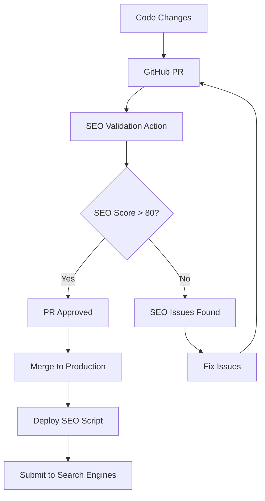
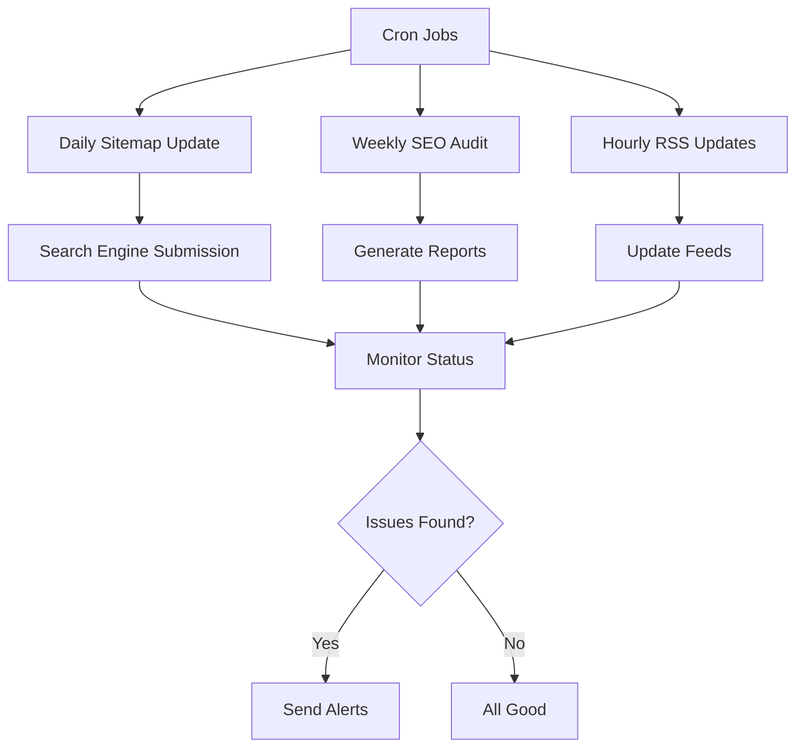
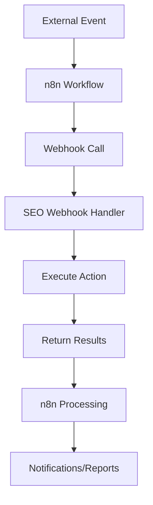

# IT-ERA SEO Automation System

Complete automated SEO workflow and CI/CD integration for the IT-ERA website (https://it-era.pages.dev/).

## 🚀 Overview

This comprehensive SEO automation system provides:

- **Automated SEO workflows** with cron jobs
- **GitHub Actions CI/CD integration** for SEO validation 
- **Post-deployment SEO tasks** with search engine submission
- **n8n webhook integration** for external tool connectivity
- **Docker-based SEO tools** for consistent analysis
- **Comprehensive error handling** and logging
- **Real-time monitoring** and alerting system

## 📁 System Components

### 1. Cron Job Automation (`/scripts/cron-setup.sh`)

Automated SEO task scheduling:

```bash
# Install SEO automation
bash scripts/cron-setup.sh install

# Check status
bash scripts/cron-setup.sh status

# Remove automation
bash scripts/cron-setup.sh remove
```

**Scheduled Tasks:**
- **Daily (3:00 AM)**: Sitemap generation and submission
- **Weekly (Sunday 4:00 AM)**: Comprehensive SEO audit
- **Hourly (:15 past hour)**: RSS feed updates
- **Monthly (1st at 5:00 AM)**: Comprehensive reports
- **Every 5 minutes**: Status monitoring

### 2. GitHub Actions SEO Validation (`.github/workflows/seo-check.yml`)

Automated SEO validation on every PR and deployment:

**Features:**
- ✅ HTML structure validation with HTMLHint
- 🔍 SEO elements analysis (title, meta description, Open Graph)
- 🗺️ Sitemap compatibility checks
- ♿ Basic accessibility testing
- 📱 Mobile optimization validation
- 🚨 Lighthouse performance auditing
- 📊 PR comment with detailed results

**Triggers:**
- Pull requests to `main`, `production`, `develop`
- Push to `main`, `production`
- Manual workflow dispatch with deep scan option

### 3. Deployment SEO Script (`/scripts/deploy-seo.php`)

Post-deployment SEO automation:

```bash
# Production deployment
php scripts/deploy-seo.php --environment=production

# Dry run test
php scripts/deploy-seo.php --dry-run

# Force execution
php scripts/deploy-seo.php --force
```

**Capabilities:**
- Search engine sitemap submission (Google, Bing, Yandex)
- New page indexing requests
- RSS feed updates
- CDN cache clearing for SEO files
- Robots.txt updates
- Performance metrics recording
- Automated notifications

### 4. n8n Webhook Integration (`/scripts/seo-webhook.php`)

RESTful webhook endpoint for external integrations:

**Supported Actions:**
```bash
# Sitemap update
POST /seo-webhook.php?action=sitemap_update

# Page indexing
POST /seo-webhook.php?action=page_indexing&urls[]=https://it-era.pages.dev/new-page.html

# Performance check
POST /seo-webhook.php?action=performance_check

# SEO audit
POST /seo-webhook.php?action=seo_audit&scope=full

# Cache clearing
POST /seo-webhook.php?action=cache_clear&paths[]=/sitemap.xml
```

**Authentication:**
- Header: `X-Webhook-Secret: your-secret-key`
- Query param: `?secret=your-secret-key`
- POST body: `{"secret": "your-secret-key"}`

### 5. Docker SEO Tools Container (`/docker/seo-tools/`)

Containerized SEO analysis tools:

```bash
# Build and start containers
cd docker/seo-tools
docker-compose up -d

# Run SEO analysis
docker exec it-era-seo-tools seo-analyze https://it-era.pages.dev

# Run comprehensive audit
docker exec it-era-seo-tools seo-audit https://it-era.pages.dev

# Run Lighthouse audit
docker exec it-era-seo-tools lighthouse https://it-era.pages.dev

# Access shell
docker exec -it it-era-seo-tools shell
```

**Included Tools:**
- 🚨 Lighthouse CI for performance auditing
- 🔍 HTMLHint for HTML validation
- ♿ Pa11y for accessibility testing
- 🗺️ Sitemap checker
- 🔗 Broken link checker
- 🐍 Python SEO analysis tools
- 📊 Custom monitoring scripts

**Dashboard Access:**
- SEO Dashboard: http://localhost:8080
- Supervisor Interface: http://localhost:9001

### 6. Error Handling & Logging (`/scripts/seo-error-handler.php`)

Comprehensive error management system:

```bash
# Check system status
php scripts/seo-error-handler.php status

# Generate error report (last 24 hours)
php scripts/seo-error-handler.php report

# Clean up old logs (30 days)
php scripts/seo-error-handler.php cleanup

# Test logging
php scripts/seo-error-handler.php test
```

**Features:**
- Structured logging with multiple levels
- Automatic error recovery with retry logic
- Performance metrics tracking
- Critical error notifications
- Log rotation and cleanup

### 7. SEO Monitoring System (`/scripts/seo-monitoring.php`)

Real-time website monitoring and alerting:

```bash
# Full comprehensive monitoring
php scripts/seo-monitoring.php full https://it-era.pages.dev

# Quick health check
php scripts/seo-monitoring.php quick https://it-era.pages.dev

# Generate dashboard data
php scripts/seo-monitoring.php dashboard
```

**Monitoring Metrics:**
- Response time and uptime
- SEO elements compliance
- Technical SEO (sitemap, robots.txt, SSL)
- Content analysis (word count, images, links)
- Performance benchmarks
- Security checks

## ⚙️ Configuration

### Environment Variables

Create `/scripts/seo-webhook-config.json`:

```json
{
  "webhook_secret": "your-secure-secret-key",
  "site_url": "https://it-era.pages.dev",
  "notification_channels": {
    "email": {
      "enabled": true,
      "smtp_user": "info@it-era.it",
      "recipient": "info@it-era.it"
    }
  },
  "search_engines": {
    "google": {
      "indexing_api": {
        "enabled": false,
        "api_key": "YOUR_GOOGLE_API_KEY"
      }
    }
  }
}
```

### GitHub Secrets

Configure in repository settings:

```
WEBHOOK_SECRET=your-webhook-secret
GOOGLE_INDEXING_API_KEY=your-google-api-key
CLOUDFLARE_API_TOKEN=your-cloudflare-token
CLOUDFLARE_ZONE_ID=your-zone-id
```

## 🔄 Workflow Integration

### 1. Development Workflow



### 2. Automated Monitoring



### 3. n8n Integration Workflow



## 📊 Monitoring & Alerts

### Alert Thresholds

- **Response Time Warning**: > 2000ms
- **Response Time Critical**: > 5000ms
- **SEO Score Warning**: < 80
- **SEO Score Critical**: < 60
- **Uptime Warning**: < 99%
- **Uptime Critical**: < 95%

### Dashboard Metrics

Access the monitoring dashboard at `http://localhost:8080` (when Docker containers are running):

- Real-time performance metrics
- SEO compliance scores
- Historical trends
- Active alerts
- System health status

## 🛠️ Setup Instructions

### 1. Install System Dependencies

```bash
# For Ubuntu/Debian
sudo apt-get update
sudo apt-get install php8.2-cli php8.2-xml php8.2-curl php8.2-zip
sudo apt-get install nodejs npm python3 python3-pip
sudo apt-get install cron supervisor

# For CentOS/RHEL
sudo yum install php php-xml php-curl php-zip
sudo yum install nodejs npm python3 python3-pip
sudo yum install cronie supervisor
```

### 2. Setup Cron Jobs

```bash
# Make script executable
chmod +x scripts/cron-setup.sh

# Install all cron jobs
sudo bash scripts/cron-setup.sh install

# Verify installation
bash scripts/cron-setup.sh status
```

### 3. Configure GitHub Actions

The workflow is automatically triggered on PR creation and push. No additional setup required.

### 4. Setup Docker Environment

```bash
# Navigate to Docker directory
cd docker/seo-tools

# Create required directories
mkdir -p volumes/{logs,reports,data}

# Build and start containers
docker-compose up -d

# Verify containers are running
docker-compose ps
```

### 5. Configure Webhooks

```bash
# Make webhook executable
chmod +x scripts/seo-webhook.php

# Test webhook functionality
curl -X POST "http://localhost/seo-webhook.php?action=status_check&secret=your-secret"
```

## 🔧 Usage Examples

### Manual SEO Tasks

```bash
# Generate sitemap manually
php scripts/generate_sitemap.php

# Run comprehensive SEO audit
php scripts/seo-monitoring.php full https://it-era.pages.dev

# Deploy with SEO tasks
php scripts/deploy-seo.php --environment=production

# Check system health
php scripts/seo-monitoring.php quick https://it-era.pages.dev
```

### API Integration Examples

```bash
# Trigger sitemap update via webhook
curl -X POST \
  "https://it-era.pages.dev/scripts/seo-webhook.php?action=sitemap_update" \
  -H "X-Webhook-Secret: your-secret-key" \
  -H "Content-Type: application/json" \
  -d '{"force": true}'

# Request page indexing
curl -X POST \
  "https://it-era.pages.dev/scripts/seo-webhook.php?action=page_indexing" \
  -H "X-Webhook-Secret: your-secret-key" \
  -H "Content-Type: application/json" \
  -d '{"urls": ["https://it-era.pages.dev/new-service.html"]}'
```

## 🎯 Performance & Optimization

### System Requirements

- **PHP**: 8.1 or higher
- **Node.js**: 18 or higher
- **Python**: 3.9 or higher
- **Memory**: Minimum 512MB for full monitoring
- **Disk**: 1GB for logs and reports storage

### Optimization Tips

1. **Adjust cron frequency** based on site update patterns
2. **Configure log retention** to balance storage and history needs
3. **Set appropriate alert thresholds** to avoid notification fatigue
4. **Use Docker resource limits** to prevent excessive resource usage
5. **Enable caching** for frequently accessed SEO data

## 🔐 Security Considerations

### Webhook Security

- Always use strong secret keys
- Implement IP whitelisting if possible
- Validate all incoming data
- Log all webhook requests for audit

### File Permissions

```bash
# Set appropriate permissions
chmod 755 scripts/
chmod 644 scripts/*.php
chmod +x scripts/*.sh
chown -R www-data:www-data /var/log/it-era-seo/
```

### API Security

- Use environment variables for sensitive data
- Rotate API keys regularly
- Monitor API usage and quotas
- Implement rate limiting for webhook endpoints

## 📝 Troubleshooting

### Common Issues

**1. Cron jobs not executing:**
```bash
# Check cron service status
sudo systemctl status cron

# Check cron logs
sudo grep -i cron /var/log/syslog

# Verify user crontab
crontab -l
```

**2. Webhook returns 403 Forbidden:**
```bash
# Check webhook secret configuration
grep -r "webhook_secret" scripts/seo-webhook-config.json

# Verify PHP file permissions
ls -la scripts/seo-webhook.php
```

**3. Docker containers not starting:**
```bash
# Check container logs
docker-compose logs seo-tools

# Verify port availability
netstat -tlnp | grep :9001

# Rebuild containers
docker-compose down && docker-compose up --build -d
```

**4. SEO validation fails in GitHub Actions:**
- Check the Actions tab for detailed error logs
- Verify all required files exist in the repository
- Ensure HTMLHint configuration is valid

### Log Locations

- **Cron logs**: `/var/log/it-era-seo/`
- **GitHub Actions**: Repository Actions tab
- **Docker logs**: `docker/seo-tools/volumes/logs/`
- **Webhook logs**: `/var/log/it-era-seo/webhook-*.log`
- **System logs**: `/var/log/syslog` (cron entries)

## 🚀 Future Enhancements

### Planned Features

- [ ] Integration with Google Search Console API
- [ ] Advanced performance monitoring with Core Web Vitals
- [ ] Machine learning-based SEO recommendations
- [ ] Multi-language SEO support
- [ ] Automated A/B testing for meta descriptions
- [ ] Social media integration for Open Graph optimization
- [ ] Advanced competitor analysis
- [ ] SEO forecasting and trend analysis

### Contributing

To contribute to the SEO automation system:

1. Fork the repository
2. Create a feature branch
3. Test your changes thoroughly
4. Submit a pull request with detailed description

---

## 📞 Support

For support and questions:

- **Email**: info@it-era.it
- **Phone**: 039 888 2041
- **Address**: Viale Risorgimento 32, Vimercate MB

---

*Generated with IT-ERA SEO Automation System v1.0*