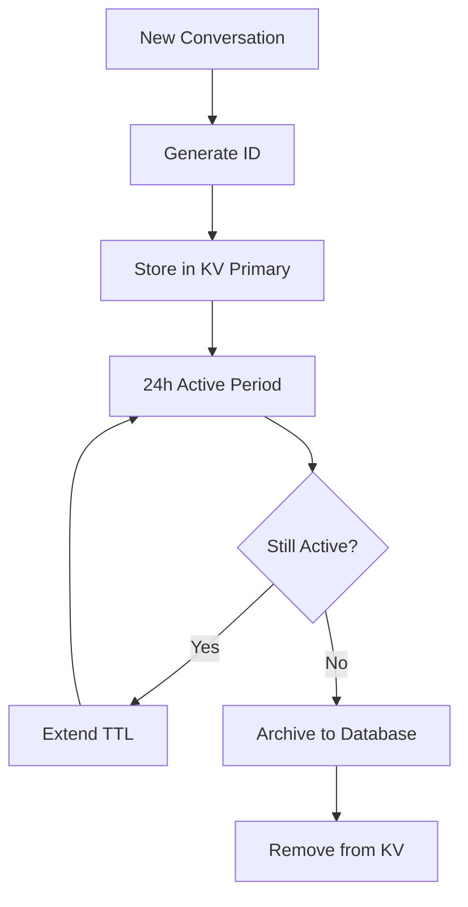

# Conversation ID System Architecture Design
*IT-ERA Chatbot Platform - Technical Specification Document*

## Executive Summary

This document defines the comprehensive architecture for the Conversation ID system within IT-ERA's chatbot platform, providing standardized ID generation, storage, lifecycle management, and operational procedures.

## 1. Conversation ID Format Standard

### 1.1 ID Structure Definition

```typescript
interface ConversationID {
  format: "ITERA_YYYYMMDD_HHMMSS_RANDOM_ENV"
  components: {
    prefix: "ITERA"           // Company identifier
    timestamp: "YYYYMMDD_HHMMSS"  // UTC timestamp
    random: string            // 12-character alphanumeric
    environment: "P|S|D"      // Production|Staging|Development
  }
  totalLength: 32            // Fixed length for indexing optimization
}
```

### 1.2 Format Examples

```
Production:   ITERA_20250125_143052_A7B9X2M8P4Q1_P
Staging:      ITERA_20250125_143052_K3F7N9R5T2W8_S  
Development:  ITERA_20250125_143052_L8H4V6C9Z1M3_D
```

### 1.3 ID Generation Algorithm

```javascript
function generateConversationID(environment = 'P') {
  const now = new Date();
  const timestamp = now.toISOString()
    .replace(/[-:]/g, '')
    .replace('T', '_')
    .substring(0, 15);
  
  const random = Array.from({length: 12}, () => 
    'ABCDEFGHIJKLMNOPQRSTUVWXYZ0123456789'[Math.floor(Math.random() * 36)]
  ).join('');
  
  return `ITERA_${timestamp}_${random}_${environment}`;
}
```

## 2. Storage Architecture Design

### 2.1 Architecture Decision: Hybrid Approach

After evaluating Cloudflare KV vs Database options, we recommend a **hybrid architecture**:

#### Primary Storage: Cloudflare KV
- **Use Case**: Active conversations (< 24 hours)
- **Benefits**: 
  - Ultra-low latency (< 100ms globally)
  - Edge distribution
  - Built-in TTL management
  - Cost-effective for active data

#### Secondary Storage: Database
- **Use Case**: Historical conversations (> 24 hours)
- **Benefits**:
  - Complex queries and analytics
  - Long-term retention
  - Data relationships
  - Compliance requirements

### 2.2 Storage Strategy Implementation

```typescript
interface StorageStrategy {
  kvStore: {
    namespace: "CHAT_SESSIONS"
    keyPrefix: "conv:"
    ttl: 86400 // 24 hours
    size_limit: "25MB per key"
    operations: ["GET", "PUT", "DELETE", "LIST"]
  }
  database: {
    table: "conversations"
    engine: "PostgreSQL"
    partitioning: "BY date (monthly)"
    indexes: ["conversation_id", "user_id", "created_at", "status"]
  }
}
```

### 2.3 Data Flow Architecture



## 3. Retention Policies

### 3.1 Data Lifecycle Management

| Phase | Duration | Storage | Actions |
|-------|----------|---------|---------|
| **Active** | 0-24h | Cloudflare KV | Real-time access, TTL extension |
| **Recent** | 1-30 days | Database (Hot) | Analytics, support queries |
| **Historical** | 31-365 days | Database (Warm) | Compliance, reporting |
| **Archive** | 1-7 years | Object Storage (Cold) | Legal retention, compressed |
| **Purge** | > 7 years | Deleted | GDPR compliance |

### 3.2 Retention Policy Rules

```typescript
interface RetentionPolicy {
  activeConversations: {
    storage: "cloudflare_kv"
    ttl: 86400 // 24 hours
    autoExtend: true
    maxExtensions: 7 // Max 7 days active
  }
  
  recentConversations: {
    storage: "database_hot"
    retention: "30 days"
    indexing: "full"
    analytics: "enabled"
  }
  
  historicalConversations: {
    storage: "database_warm"
    retention: "365 days"
    indexing: "limited"
    compression: "enabled"
  }
  
  archivedConversations: {
    storage: "object_storage_cold"
    retention: "7 years"
    format: "compressed_json"
    access: "request_based"
  }
  
  gdprCompliance: {
    userDeletionRequest: "immediate_purge"
    dataMinimization: "pii_pseudonymization"
    rightToPortability: "json_export"
  }
}
```

## 4. API Endpoints Design

### 4.1 Core Conversation API

```typescript
// GET /api/v1/conversations/{id}
interface GetConversationResponse {
  conversationId: string
  status: "active" | "completed" | "archived"
  created: string
  lastActivity: string
  messageCount: number
  metadata: ConversationMetadata
}

// POST /api/v1/conversations
interface CreateConversationRequest {
  userAgent?: string
  initialContext?: Record<string, any>
  source: "widget" | "api" | "embed"
}

// PUT /api/v1/conversations/{id}/extend
interface ExtendConversationRequest {
  extensionHours: number // Max 168 (7 days)
  reason: string
}

// DELETE /api/v1/conversations/{id}
interface ArchiveConversationRequest {
  reason: "completed" | "user_request" | "timeout" | "manual"
  preserveData: boolean
}
```

### 4.2 Management & Analytics APIs

```typescript
// GET /api/v1/conversations/analytics
interface AnalyticsQuery {
  dateFrom: string
  dateTo: string
  metrics: ("count" | "duration" | "messages" | "completion_rate")[]
  groupBy?: "hour" | "day" | "week"
}

// GET /api/v1/conversations/search
interface SearchQuery {
  query?: string
  dateRange?: [string, string]
  status?: ConversationStatus[]
  userId?: string
  source?: string[]
  limit?: number
  offset?: number
}

// POST /api/v1/conversations/bulk-archive
interface BulkArchiveRequest {
  filters: SearchQuery
  dryRun: boolean
  reason: string
}
```

### 4.3 Health & Monitoring APIs

```typescript
// GET /api/v1/system/conversation-metrics
interface SystemMetrics {
  activeConversations: number
  dailyNewConversations: number
  averageSessionDuration: number
  storageUtilization: {
    kvStore: { used: number, limit: number }
    database: { size: number, growth: number }
  }
  performanceMetrics: {
    averageResponseTime: number
    p99ResponseTime: number
    errorRate: number
  }
}
```

## 5. Metrics and Monitoring Strategy

### 5.1 Key Performance Indicators (KPIs)

#### Operational Metrics
```typescript
interface OperationalMetrics {
  availability: {
    target: "99.9%"
    measurement: "uptime per month"
  }
  performance: {
    responseTime: {
      target: "< 100ms"
      measurement: "p95 response time"
    }
    throughput: {
      target: "1000 req/sec"
      measurement: "peak concurrent requests"
    }
  }
  reliability: {
    errorRate: {
      target: "< 0.1%"
      measurement: "failed requests / total requests"
    }
  }
}
```

#### Business Metrics
```typescript
interface BusinessMetrics {
  engagement: {
    conversationCompletionRate: number
    averageMessagesPerConversation: number
    userRetentionRate: number
  }
  efficiency: {
    automaticResolutionRate: number
    escalationRate: number
    customerSatisfactionScore: number
  }
  growth: {
    dailyActiveConversations: number
    monthlyConversationGrowth: number
    platformAdoptionRate: number
  }
}
```

### 5.2 Monitoring Infrastructure

```typescript
interface MonitoringStack {
  realTimeMetrics: {
    tool: "Cloudflare Analytics"
    dashboards: ["operational", "business", "security"]
    alerting: "immediate"
  }
  
  applicationMetrics: {
    tool: "Prometheus + Grafana"
    retention: "90 days"
    scrapeInterval: "30s"
  }
  
  logAggregation: {
    tool: "ELK Stack"
    retention: "30 days"
    indexing: "conversation_id, timestamp, level"
  }
  
  alerting: {
    channels: ["email", "slack", "pagerduty"]
    escalation: "5min -> 15min -> 30min"
    severity: ["critical", "warning", "info"]
  }
}
```

### 5.3 Alert Definitions

```yaml
alerts:
  critical:
    - name: "Conversation Creation Failure"
      condition: "error_rate > 5%"
      duration: "2m"
      action: "immediate_page"
    
    - name: "KV Store Unavailable"
      condition: "kv_availability < 99%"
      duration: "1m"
      action: "immediate_page"
  
  warning:
    - name: "High Response Time"
      condition: "p95_response_time > 200ms"
      duration: "5m"
      action: "slack_notification"
    
    - name: "Storage Utilization High"
      condition: "storage_used > 80%"
      duration: "10m"
      action: "email_alert"
```

## 6. Backup and Recovery Strategy

### 6.1 Backup Architecture

```typescript
interface BackupStrategy {
  realTime: {
    method: "Cross-region KV replication"
    frequency: "continuous"
    rpo: "0 minutes" // No data loss
    rto: "< 1 minute" // Instant failover
  }
  
  daily: {
    method: "Database snapshot + Object storage"
    frequency: "every 24h at 02:00 UTC"
    retention: "30 days"
    compression: "gzip"
  }
  
  weekly: {
    method: "Full data export"
    frequency: "every Sunday at 01:00 UTC"
    retention: "12 weeks"
    format: "encrypted_archive"
    location: "separate_cloud_provider"
  }
  
  monthly: {
    method: "Complete system backup"
    frequency: "first Sunday of month"
    retention: "24 months"
    testing: "quarterly_restore_test"
  }
}
```

### 6.2 Disaster Recovery Plan

#### Recovery Time Objectives (RTO)
- **Critical Systems**: 15 minutes
- **Primary Database**: 1 hour
- **Analytics Systems**: 4 hours
- **Reporting Systems**: 24 hours

#### Recovery Point Objectives (RPO)
- **Active Conversations**: 0 data loss
- **Recent Conversations**: < 5 minutes data loss
- **Historical Data**: < 1 hour data loss
- **Analytics Data**: < 24 hours data loss

### 6.3 Recovery Procedures

```typescript
interface RecoveryProcedures {
  kvStoreFailure: {
    detection: "automated_health_check"
    action: "immediate_failover_to_replica"
    timeline: "< 60 seconds"
    rollback: "manual_if_needed"
  }
  
  databaseFailure: {
    detection: "connection_timeout + health_check"
    action: "restore_from_latest_snapshot"
    timeline: "< 30 minutes"
    dataLoss: "< 5 minutes"
  }
  
  completeSystemFailure: {
    detection: "multiple_service_failure"
    action: "activate_disaster_recovery_site"
    timeline: "< 2 hours"
    coordination: "incident_response_team"
  }
  
  dataCorruption: {
    detection: "integrity_check_failure"
    action: "restore_from_clean_backup"
    timeline: "< 4 hours"
    validation: "mandatory_data_integrity_check"
  }
}
```

## 7. Security and Privacy Considerations

### 7.1 Data Protection Framework

```typescript
interface SecurityFramework {
  dataEncryption: {
    atRest: "AES-256-GCM"
    inTransit: "TLS 1.3"
    keyManagement: "Cloudflare_SSL_for_SaaS"
  }
  
  accessControl: {
    authentication: "JWT_with_rotation"
    authorization: "RBAC_with_API_keys"
    auditLogging: "all_access_logged"
  }
  
  dataMinimization: {
    piiDetection: "automated_scanning"
    pseudonymization: "reversible_hashing"
    retention: "policy_enforced_deletion"
  }
  
  compliance: {
    gdpr: "full_compliance"
    privacy: "privacy_by_design"
    auditTrail: "immutable_logs"
  }
}
```

### 7.2 Privacy by Design Implementation

#### Data Collection Principles
1. **Proactive Not Reactive**: Built-in privacy protection
2. **Privacy as the Default**: Maximum privacy settings by default  
3. **Full Functionality**: Privacy without compromising functionality
4. **End-to-End Security**: Secure lifecycle management
5. **Visibility and Transparency**: Clear data handling processes
6. **Respect for User Privacy**: User control over personal data

#### GDPR Compliance Features
```typescript
interface GDPRCompliance {
  rightToAccess: {
    endpoint: "GET /api/v1/users/{id}/data"
    format: "structured_json_export"
    timeline: "within_30_days"
  }
  
  rightToRectification: {
    endpoint: "PUT /api/v1/conversations/{id}/correct"
    validation: "user_identity_verified"
    auditLog: "change_recorded"
  }
  
  rightToErasure: {
    endpoint: "DELETE /api/v1/users/{id}/data"
    scope: "all_related_conversations"
    timeline: "within_72_hours"
    verification: "deletion_confirmed"
  }
  
  rightToPortability: {
    endpoint: "GET /api/v1/users/{id}/export"
    format: "machine_readable_json"
    includes: "all_conversation_data"
  }
  
  consentManagement: {
    tracking: "granular_consent_levels"
    withdrawal: "immediate_effect"
    documentation: "consent_audit_trail"
  }
}
```

## 8. Architecture Decision Records (ADRs)

### ADR-001: Hybrid Storage Architecture
**Status**: Accepted  
**Date**: 2025-01-25  

**Context**: Need to balance performance, cost, and functionality for conversation storage.

**Decision**: Implement hybrid architecture with Cloudflare KV for active conversations and PostgreSQL for historical data.

**Consequences**: 
- ✅ Optimal performance for active conversations
- ✅ Cost-effective storage strategy  
- ✅ Powerful analytics capabilities
- ❌ Increased complexity in data management
- ❌ Need for robust data migration processes

### ADR-002: Conversation ID Format
**Status**: Accepted  
**Date**: 2025-01-25  

**Context**: Need standardized, unique, and informative conversation identifiers.

**Decision**: Use format `ITERA_YYYYMMDD_HHMMSS_RANDOM_ENV` with 32-character fixed length.

**Consequences**:
- ✅ Human-readable timestamps
- ✅ Global uniqueness guaranteed
- ✅ Environment separation
- ✅ Fixed length for indexing optimization
- ❌ Longer IDs than simple UUIDs

### ADR-003: 24-Hour Active Window
**Status**: Accepted  
**Date**: 2025-01-25  

**Context**: Balance between user experience and resource utilization.

**Decision**: Keep conversations active in KV store for 24 hours with extension capability.

**Consequences**:
- ✅ Covers typical customer interaction patterns
- ✅ Automatic cleanup reduces storage costs
- ✅ Extension capability for complex cases
- ❌ May require user education about session timeouts

## 9. Implementation Roadmap

### Phase 1: Foundation (Weeks 1-2)
- [ ] Implement conversation ID generation system
- [ ] Set up KV store structure and configurations
- [ ] Create basic CRUD APIs for conversations
- [ ] Implement TTL management

### Phase 2: Storage Strategy (Weeks 3-4)  
- [ ] Set up database schema and connections
- [ ] Implement hybrid storage logic
- [ ] Create data migration processes
- [ ] Implement retention policy automation

### Phase 3: Monitoring & Analytics (Weeks 5-6)
- [ ] Deploy monitoring infrastructure
- [ ] Create operational dashboards
- [ ] Implement alerting systems
- [ ] Set up analytics APIs

### Phase 4: Security & Compliance (Weeks 7-8)
- [ ] Implement encryption and access controls
- [ ] Create GDPR compliance features
- [ ] Set up audit logging
- [ ] Complete security testing

### Phase 5: Backup & Recovery (Weeks 9-10)
- [ ] Implement backup systems
- [ ] Create disaster recovery procedures
- [ ] Test recovery processes
- [ ] Document operational procedures

### Phase 6: Production Deployment (Weeks 11-12)
- [ ] Production environment setup
- [ ] Performance testing and optimization
- [ ] Staff training and documentation
- [ ] Go-live and monitoring

## 10. Success Metrics

### Technical Success Criteria
- **Performance**: 99.9% of conversation ID operations complete in < 100ms
- **Reliability**: 99.99% system uptime
- **Scalability**: Handle 10,000+ concurrent conversations
- **Data Integrity**: Zero data loss incidents

### Business Success Criteria  
- **User Experience**: Seamless conversation continuity
- **Operational Efficiency**: 50% reduction in conversation management overhead
- **Compliance**: 100% GDPR compliance audit pass
- **Cost Optimization**: 30% reduction in storage costs through efficient tiering

---

## Conclusion

This conversation ID system architecture provides IT-ERA with a robust, scalable, and compliant foundation for managing chatbot conversations. The hybrid storage approach optimizes for both performance and cost while ensuring data integrity and regulatory compliance.

The phased implementation approach allows for iterative deployment and validation, minimizing risk while delivering immediate value to the business.

**Next Steps**: 
1. Review and approve architecture design
2. Allocate development resources for Phase 1 implementation  
3. Set up development environments and tooling
4. Begin implementation of conversation ID generation system

---

*Document Version: 1.0*  
*Last Updated: 2025-01-25*  
*Author: System Architecture Team*  
*Reviewers: CTO, Lead Developer, Security Officer*