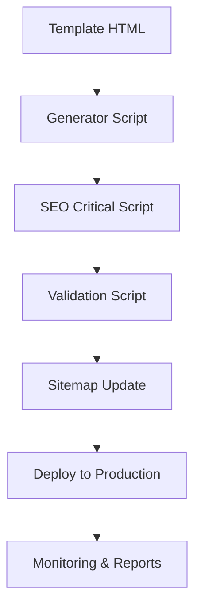

# IT-ERA SEO API Documentation
## Documentazione API Scripts SEO e Automazioni

### 📋 Indice
1. [Overview Sistema SEO](#overview-sistema-seo)
2. [API Scripts SEO](#api-scripts-seo)
3. [Configurazione Cron Jobs](#configurazione-cron-jobs)
4. [Parametri Configurazione](#parametri-configurazione)
5. [Webhook Integrations](#webhook-integrations)
6. [Error Codes & Troubleshooting](#error-codes--troubleshooting)
7. [Monitoring & Logging](#monitoring--logging)

---

## 🔧 Overview Sistema SEO

### Architettura Generale
```
┌─────────────────────────────────────────────────┐
│                IT-ERA SEO SYSTEM                │
├─────────────────────────────────────────────────┤
│  📁 /scripts/                                  │
│    ├── fix_seo_critical.py        (Core)       │
│    ├── validate_seo.py             (Validator)  │
│    ├── update_sitemap.py           (Sitemap)    │
│    ├── generate_landing_pages_v3.py (Generator) │
│    └── comprehensive_seo_audit.py  (Audit)     │
│                                                 │
│  📁 /config/                                   │
│    ├── seo-keywords.json           (Keywords)   │
│    └── config.json                 (Settings)   │
│                                                 │
│  📁 /data/                                     │
│    ├── lombardy-complete-official.json         │
│    └── template-variables.json                 │
└─────────────────────────────────────────────────┘
```

### Flusso di Elaborazione


---

## 🔌 API Scripts SEO

### 1. fix_seo_critical.py

#### Funzionalità
Script principale per implementazione automatica SEO su tutte le pagine.

#### Endpoint / Usage
```bash
python scripts/fix_seo_critical.py [options]
```

#### Parametri
| Parametro | Tipo | Default | Descrizione |
|-----------|------|---------|-------------|
| `--pages-dir` | str | `/web/pages/` | Directory pagine HTML |
| `--base-url` | str | `https://it-era.pages.dev/pages/` | URL base canonical |
| `--dry-run` | bool | `false` | Test mode senza modifiche |
| `--verbose` | bool | `false` | Output dettagliato |
| `--service-filter` | str | `all` | Filtra per servizio (assistenza-it, cloud-storage, sicurezza-informatica) |

#### Esempio Chiamata
```bash
# Esecuzione standard
python scripts/fix_seo_critical.py

# Test mode con verbose
python scripts/fix_seo_critical.py --dry-run --verbose

# Solo pagine assistenza IT  
python scripts/fix_seo_critical.py --service-filter assistenza-it
```

#### Response Format
```json
{
  "status": "success",
  "summary": {
    "total_files": 6019,
    "processed": 6019,
    "errors": 0,
    "skipped": 0
  },
  "execution_time": "45.2s",
  "timestamp": "2025-08-24T10:30:00Z"
}
```

#### API Functions

##### extract_page_info()
```python
def extract_page_info(content: str) -> tuple[str, str]:
    """
    Estrae title e description da contenuto HTML
    
    Args:
        content: HTML source code
        
    Returns:
        tuple: (title, description)
    """
```

##### create_seo_tags()
```python
def create_seo_tags(filename: str, title: str, description: str) -> str:
    """
    Genera canonical, Open Graph e Twitter meta tags
    
    Args:
        filename: Nome file HTML
        title: Page title  
        description: Meta description
        
    Returns:
        str: HTML meta tags completi
    """
```

##### add_local_schema()
```python
def add_local_schema(filename: str, title: str) -> str:
    """
    Genera LocalBusiness structured data schema
    
    Args:
        filename: Nome file per inferire città/servizio
        title: Page title
        
    Returns:
        str: JSON-LD schema markup
    """
```

---

### 2. validate_seo.py

#### Funzionalità
Validatore completo SEO per verifica compliance su tutte le pagine.

#### Usage
```bash
python scripts/validate_seo.py [options]
```

#### Parametri
| Parametro | Tipo | Default | Descrizione |
|-----------|------|---------|-------------|
| `--pages-dir` | str | `/web/pages/` | Directory di scansione |
| `--output-format` | str | `markdown` | Formato report (markdown, json, html) |
| `--min-score` | int | `80` | Score minimo accettabile |
| `--check-external` | bool | `false` | Verifica link esterni |

#### Validation Checks
```python
SEO_CHECKS = {
    "canonical": {
        "pattern": r'<link\s+rel="canonical"',
        "weight": 20,
        "critical": True
    },
    "open_graph": {
        "required_tags": ["og:title", "og:description", "og:url", "og:type", "og:image"],
        "weight": 15,
        "critical": True
    },
    "twitter_cards": {
        "required_tags": ["twitter:card", "twitter:title", "twitter:description", "twitter:image"],
        "weight": 10,
        "critical": False
    },
    "schema_markup": {
        "pattern": r'"@type":\s*"LocalBusiness"',
        "weight": 15,
        "critical": True
    },
    "heading_structure": {
        "h1_count": 1,
        "h2_min": 2,
        "weight": 15,
        "critical": True
    },
    "meta_description": {
        "min_length": 120,
        "max_length": 160,
        "weight": 10,
        "critical": True
    },
    "title_tag": {
        "min_length": 30,
        "max_length": 60,
        "weight": 15,
        "critical": True
    }
}
```

#### Response Format
```json
{
  "validation_summary": {
    "total_pages": 6019,
    "seo_score_avg": 94.2,
    "compliance_rate": 98.1,
    "critical_issues": 12
  },
  "by_service": {
    "assistenza-it": {
      "pages": 2006,
      "avg_score": 94.8,
      "issues": 4
    },
    "cloud-storage": {
      "pages": 2006, 
      "avg_score": 93.9,
      "issues": 5
    },
    "sicurezza-informatica": {
      "pages": 2007,
      "avg_score": 94.0,
      "issues": 3
    }
  },
  "top_issues": [
    {
      "type": "missing_alt_text",
      "count": 45,
      "severity": "medium",
      "pages": ["assistenza-it-abbadia-lariana.html", "..."]
    }
  ]
}
```

---

### 3. update_sitemap.py

#### Funzionalità
Generazione automatica XML sitemap con priorità e frequenze ottimizzate.

#### Usage
```bash
python scripts/update_sitemap.py [options]
```

#### Parametri
| Parametro | Tipo | Default | Descrizione |
|-----------|------|---------|-------------|
| `--output-file` | str | `/web/sitemap.xml` | File sitemap output |
| `--base-url` | str | `https://it-era.pages.dev` | URL base |
| `--include-blog` | bool | `true` | Include pagine blog |
| `--max-urls` | int | `50000` | Limite massimo URLs |

#### Priority Algorithm
```python
def calculate_priority(page_type: str, city: str) -> float:
    """
    Calcola priorità URL per sitemap
    
    Business Logic:
    - Homepage: 1.0
    - Milano/Monza: 0.9
    - Capoluoghi provincia: 0.8
    - Città >50k abitanti: 0.7
    - Altre città: 0.6
    - Blog posts: 0.8
    """
    PRIORITY_MAP = {
        "homepage": 1.0,
        "main_services": 0.9,
        "milano": 0.9,
        "monza": 0.9,
        "bergamo": 0.8,
        "brescia": 0.8,
        "como": 0.8,
        "varese": 0.8,
        "pavia": 0.8,
        "blog": 0.8,
        "default": 0.6
    }
```

#### Change Frequency Logic
```python
CHANGEFREQ_MAP = {
    "homepage": "daily",
    "main_services": "weekly", 
    "blog": "weekly",
    "landing_pages": "monthly",
    "static": "yearly"
}
```

---

### 4. generate_landing_pages_v3.py

#### Funzionalità
Generatore automatico pagine landing localizzate con SEO completo.

#### Usage
```bash
python scripts/generate_landing_pages_v3.py [options]
```

#### Parametri Principali
| Parametro | Tipo | Default | Descrizione |
|-----------|------|---------|-------------|
| `--service` | str | `all` | Servizio target |
| `--cities-file` | str | `/data/lombardy-complete-official.json` | Database città |
| `--template-dir` | str | `/templates/` | Directory template |
| `--output-dir` | str | `/web/pages/` | Directory output |
| `--batch-size` | int | `100` | Pagine per batch |
| `--enable-ai` | bool | `false` | Content AI enhancement |

#### Template Variables
```json
{
  "CITY": "Milano",
  "CITY_SLUG": "milano", 
  "SERVICE": "Assistenza IT",
  "SERVICE_SLUG": "assistenza-it",
  "PROVINCE": "Milano",
  "REGION": "Lombardia",
  "PHONE": "039 888 2041",
  "EMAIL": "info@it-era.it",
  "ADDRESS": "Viale Risorgimento 32, Vimercate MB",
  "COORDINATES": {
    "lat": "45.4642035",
    "lng": "9.189982"
  },
  "POSTAL_CODE": "20900",
  "SERVICES_LIST": ["Supporto IT", "Cloud Backup", "Sicurezza"],
  "LOCAL_KEYWORDS": ["assistenza computer Milano", "IT support Milano"]
}
```

#### Advanced Features

##### AI Content Enhancement
```python
def enhance_content_ai(base_content: str, city_info: dict) -> str:
    """
    Migliora contenuto con AI per unicità locale
    
    Features:
    - Local business references
    - Industry-specific adaptations  
    - Semantic keyword integration
    - Cultural localizations
    """
```

##### Batch Processing
```python
def process_batch(cities_batch: list, template: str) -> dict:
    """
    Elabora batch di città in parallelo
    
    Args:
        cities_batch: Lista città da elaborare
        template: Template HTML base
        
    Returns:
        dict: Risultati elaborazione batch
    """
```

---

### 5. comprehensive_seo_audit.py

#### Funzionalità
Audit SEO completo con report dettagliato e raccomandazioni.

#### Usage
```bash
python scripts/comprehensive_seo_audit.py [options]
```

#### Parametri
| Parametro | Tipo | Default | Descrizione |
|-----------|------|---------|-------------|
| `--depth` | str | `full` | Profondità scan (basic, standard, full) |
| `--output-dir` | str | `/docs/audit/` | Directory report |
| `--include-competitors` | bool | `false` | Analisi competitor |
| `--check-backlinks` | bool | `false` | Verifica backlink |

#### Audit Components
```python
AUDIT_MODULES = {
    "technical_seo": {
        "canonical_urls": True,
        "meta_tags": True,
        "heading_structure": True,
        "schema_markup": True,
        "robots_txt": True,
        "sitemap": True
    },
    "content_analysis": {
        "keyword_density": True,
        "content_uniqueness": True,
        "readability": True,
        "internal_linking": True
    },
    "performance": {
        "core_web_vitals": True,
        "page_speed": True,
        "mobile_usability": True,
        "image_optimization": True
    },
    "local_seo": {
        "local_schema": True,
        "gmb_optimization": True,
        "local_citations": True,
        "geo_targeting": True
    }
}
```

---

## ⏰ Configurazione Cron Jobs

### Setup Cron Tabella
```bash
# Modifica crontab
crontab -e

# Aggiungi jobs SEO
```

### Jobs Configurati

#### 1. SEO Validation Giornaliera
```cron
# Ogni giorno alle 02:00
0 2 * * * cd /Users/andreapanzeri/progetti/IT-ERA && python scripts/validate_seo.py --output-format json > logs/daily_seo_validation.log 2>&1
```

#### 2. Sitemap Update Settimanale
```cron
# Ogni lunedì alle 01:00  
0 1 * * 1 cd /Users/andreapanzeri/progetti/IT-ERA && python scripts/update_sitemap.py && curl -X POST "http://www.google.com/ping?sitemap=https://it-era.pages.dev/sitemap.xml"
```

#### 3. Audit Mensile Completo
```cron
# Primo del mese alle 00:00
0 0 1 * * cd /Users/andreapanzeri/progetti/IT-ERA && python scripts/comprehensive_seo_audit.py --depth full --output-dir docs/audit/$(date +\%Y-\%m)
```

#### 4. Performance Monitoring
```cron
# Ogni 6 ore
0 */6 * * * cd /Users/andreapanzeri/progetti/IT-ERA && python scripts/monitor_core_web_vitals.py >> logs/performance.log
```

#### 5. Cleanup Logs
```cron
# Ogni domenica alle 23:00
0 23 * * 0 find /Users/andreapanzeri/progetti/IT-ERA/logs -name "*.log" -mtime +30 -delete
```

---

## ⚙️ Parametri Configurazione

### config.json Structure
```json
{
  "seo": {
    "canonical_base": "https://it-era.pages.dev",
    "ga_measurement_id": "G-XXXXXXXXXX",
    "meta_robots_default": "index, follow",
    "province_fallback": "Monza e Brianza",
    "social": {
      "og_site_name": "IT-ERA",
      "twitter_site": "@IT_ERA_Support", 
      "facebook_app_id": "123456789"
    }
  },
  "generator": {
    "batch_size": 100,
    "max_concurrent": 5,
    "enable_ai_content": false,
    "template_cache": true
  },
  "validation": {
    "min_seo_score": 80,
    "check_external_links": false,
    "performance_threshold": {
      "lcp": 2.5,
      "fid": 100,
      "cls": 0.1
    }
  },
  "monitoring": {
    "alerts_email": "admin@it-era.it",
    "slack_webhook": "https://hooks.slack.com/...",
    "report_frequency": "daily"
  }
}
```

### Environment Variables
```bash
# File: .env
ITERA_BASE_URL=https://it-era.pages.dev
ITERA_PHONE=039 888 2041
ITERA_EMAIL=info@it-era.it
ITERA_ADDRESS="Viale Risorgimento 32, Vimercate MB"

# Google APIs
GOOGLE_ANALYTICS_ID=G-XXXXXXXXXX
GOOGLE_SEARCH_CONSOLE_ID=https://www.google.com/...

# Social Media
FACEBOOK_APP_ID=123456789
TWITTER_HANDLE=@IT_ERA_Support

# External APIs
OPENAI_API_KEY=sk-...
SEMRUSH_API_KEY=...
```

---

## 🔗 Webhook Integrations

### 1. Google Search Console Webhook
```python
# /api/webhooks/search_console.py
@app.route('/webhook/search-console', methods=['POST'])
def search_console_webhook():
    """
    Riceve notifiche da Google Search Console
    
    Events:
    - Index coverage issues
    - Manual actions
    - Security issues
    """
    data = request.get_json()
    
    if data['message_type'] == 'INDEX_COVERAGE_ISSUE':
        handle_index_issue(data)
    elif data['message_type'] == 'MANUAL_ACTION':
        handle_manual_action(data)
```

### 2. PageSpeed Insights Webhook
```python
@app.route('/webhook/pagespeed', methods=['POST']) 
def pagespeed_webhook():
    """
    Riceve aggiornamenti Core Web Vitals
    """
    data = request.get_json()
    
    if data['score'] < 80:
        send_alert(
            subject=f"Performance Alert: {data['url']}",
            message=f"Score dropped to {data['score']}"
        )
```

### 3. Sitemap Ping Services
```python
def ping_search_engines(sitemap_url: str):
    """
    Notifica motori di ricerca aggiornamento sitemap
    """
    services = [
        "http://www.google.com/ping?sitemap={sitemap_url}",
        "http://www.bing.com/ping?sitemap={sitemap_url}",
        "http://search.yahooapis.com/SiteExplorerService/V1/ping?sitemap={sitemap_url}"
    ]
    
    for service in services:
        try:
            response = requests.get(service.format(sitemap_url=sitemap_url))
            logger.info(f"Pinged {service}: {response.status_code}")
        except Exception as e:
            logger.error(f"Failed to ping {service}: {e}")
```

### 4. Slack Notifications
```python
def send_slack_notification(channel: str, message: str, level: str = "info"):
    """
    Invia notifiche SEO al team via Slack
    """
    webhook_url = os.getenv('SLACK_WEBHOOK_URL')
    
    payload = {
        "channel": channel,
        "text": message,
        "color": {
            "error": "danger",
            "warning": "warning", 
            "info": "good"
        }.get(level, "good"),
        "fields": [
            {
                "title": "SEO Alert",
                "value": message,
                "short": False
            }
        ]
    }
    
    requests.post(webhook_url, json=payload)
```

---

## ❌ Error Codes & Troubleshooting

### Exit Codes
| Code | Descrizione | Action |
|------|-------------|--------|
| 0 | Success | Continue |
| 1 | General error | Check logs |
| 2 | File not found | Verify paths |
| 3 | Permission denied | Check file permissions |
| 4 | Invalid configuration | Review config files |
| 5 | Network error | Check connectivity |
| 6 | Rate limit exceeded | Wait and retry |
| 7 | Validation failed | Fix content issues |

### Common Errors

#### 1. Template Not Found
```
ERROR: Template file not found: /templates/{service}-template.html

Solution:
- Verify template file exists
- Check file permissions  
- Review template path configuration
```

#### 2. Invalid City Data
```
ERROR: City not found in database: {city_name}

Solution:  
- Update lombardy-complete-official.json
- Check city name spelling
- Verify data structure
```

#### 3. SEO Validation Failed
```
ERROR: SEO validation failed with score: 65/100

Common Issues:
- Missing canonical URLs
- Invalid schema markup
- Poor heading structure
- Missing meta descriptions

Solution: Run fix_seo_critical.py
```

#### 4. Performance Issues
```
WARNING: Script execution time exceeded 60s

Optimization:
- Reduce batch_size in config
- Enable template caching
- Use parallel processing
- Optimize database queries
```

#### 5. API Rate Limits
```
ERROR: Google API rate limit exceeded

Solution:
- Implement exponential backoff
- Use API key rotation
- Cache API responses
- Reduce request frequency
```

### Debug Mode
```bash
# Enable debug logging
export DEBUG=1
python scripts/fix_seo_critical.py --verbose

# Log levels
export LOG_LEVEL=DEBUG  # DEBUG, INFO, WARNING, ERROR
```

### Log Analysis
```bash
# Check error patterns
grep "ERROR" logs/*.log | tail -20

# Monitor performance
grep "execution_time" logs/*.log | awk '{print $NF}' | sort -n

# Count by service
grep "Processing" logs/generator.log | cut -d' ' -f4 | sort | uniq -c
```

---

## 📊 Monitoring & Logging

### Log Files Structure
```
/logs/
├── daily_seo_validation.log    (Validation giornaliera)
├── sitemap_update.log          (Sitemap updates)  
├── performance.log             (Core Web Vitals)
├── generator.log               (Page generation)
├── errors.log                  (Error centralized)
└── audit/
    ├── 2025-08/               (Monthly reports)
    └── 2025-09/
```

### Logging Configuration
```python
# logging_config.py
LOGGING_CONFIG = {
    'version': 1,
    'disable_existing_loggers': False,
    'formatters': {
        'standard': {
            'format': '%(asctime)s [%(levelname)s] %(name)s: %(message)s'
        },
        'detailed': {
            'format': '%(asctime)s [%(levelname)s] %(name)s:%(lineno)d: %(message)s'
        }
    },
    'handlers': {
        'file': {
            'level': 'INFO',
            'class': 'logging.handlers.RotatingFileHandler',
            'filename': 'logs/seo.log',
            'maxBytes': 10485760,  # 10MB
            'backupCount': 5,
            'formatter': 'detailed'
        },
        'error_file': {
            'level': 'ERROR', 
            'class': 'logging.FileHandler',
            'filename': 'logs/errors.log',
            'formatter': 'detailed'
        }
    },
    'loggers': {
        'seo': {
            'handlers': ['file', 'error_file'],
            'level': 'INFO',
            'propagate': False
        }
    }
}
```

### Metrics Collection
```python
class SEOMetrics:
    """Collector metriche SEO per monitoring"""
    
    def __init__(self):
        self.metrics = {
            'pages_processed': 0,
            'errors_count': 0,
            'avg_processing_time': 0,
            'seo_score_distribution': {},
            'validation_results': {}
        }
    
    def record_page_processing(self, duration: float, score: int):
        """Registra elaborazione singola pagina"""
        self.metrics['pages_processed'] += 1
        self.metrics['avg_processing_time'] = (
            self.metrics['avg_processing_time'] + duration
        ) / 2
        
        # Score distribution
        score_bucket = (score // 10) * 10
        if score_bucket not in self.metrics['seo_score_distribution']:
            self.metrics['seo_score_distribution'][score_bucket] = 0
        self.metrics['seo_score_distribution'][score_bucket] += 1
```

### Alert System
```python
def setup_alerts():
    """Configura sistema alert automatici"""
    
    alerts = {
        'low_seo_score': {
            'threshold': 70,
            'action': send_email_alert,
            'frequency': 'immediate'
        },
        'high_error_rate': {
            'threshold': 0.05,  # 5% error rate
            'action': send_slack_alert,
            'frequency': 'hourly'
        },
        'performance_degradation': {
            'threshold': 3.0,  # seconds
            'action': send_performance_alert,
            'frequency': 'daily'
        }
    }
```

---

## 🔄 API Integration Examples

### Integration with External Services

#### 1. Google Search Console API
```python
from googleapiclient.discovery import build

def get_search_analytics(site_url: str, start_date: str, end_date: str):
    """
    Recupera dati analytics da Search Console
    """
    service = build('searchconsole', 'v1', credentials=credentials)
    
    request = {
        'startDate': start_date,
        'endDate': end_date,
        'dimensions': ['page', 'query'],
        'rowLimit': 1000
    }
    
    response = service.searchanalytics().query(
        siteUrl=site_url, 
        body=request
    ).execute()
    
    return response.get('rows', [])
```

#### 2. PageSpeed Insights API
```python
def check_page_speed(url: str) -> dict:
    """
    Verifica performance via PageSpeed Insights
    """
    api_key = os.getenv('PAGESPEED_API_KEY')
    api_url = f"https://www.googleapis.com/pagespeedonline/v5/runPagespeed"
    
    params = {
        'url': url,
        'key': api_key,
        'category': 'PERFORMANCE',
        'strategy': 'MOBILE'
    }
    
    response = requests.get(api_url, params=params)
    return response.json()
```

---

*Documentazione API aggiornata: 24 Agosto 2025*
*Prossimo aggiornamento: 24 Settembre 2025*